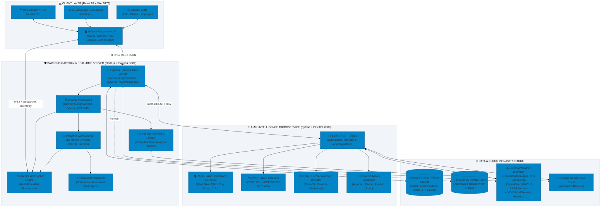
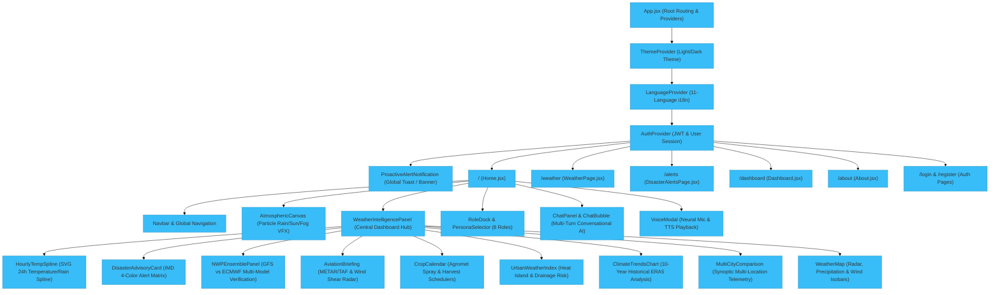
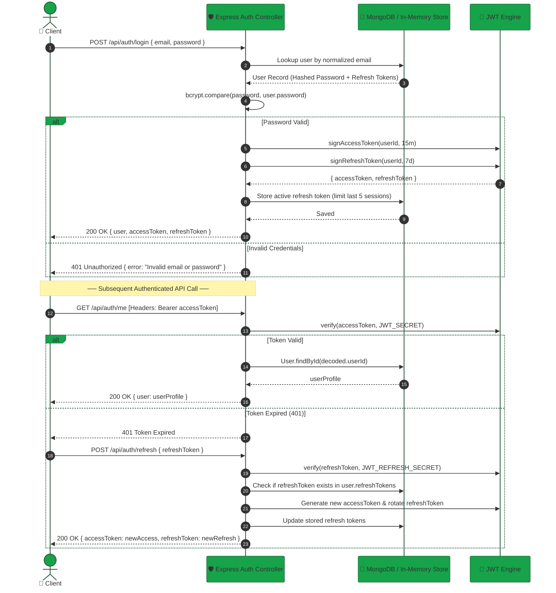
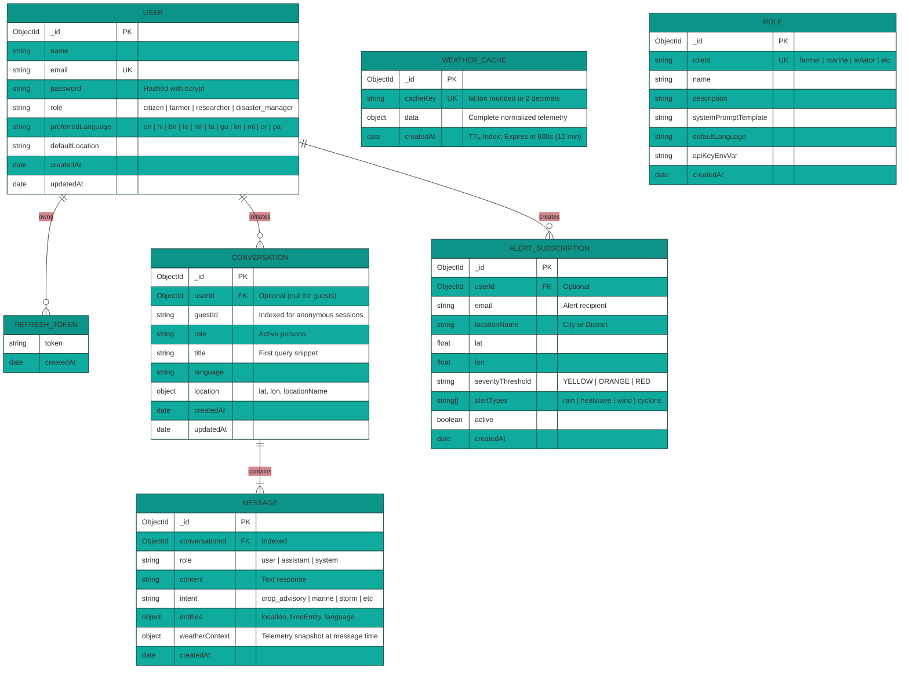
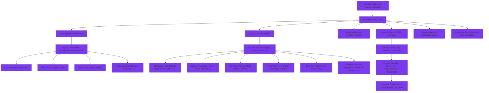
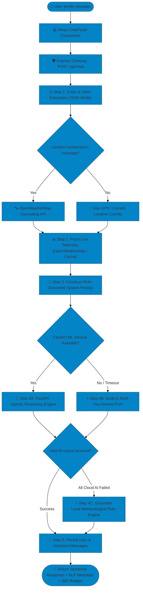
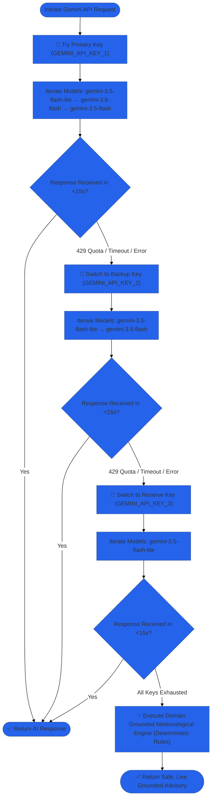

# 🏗️ WeatherGPT — Comprehensive System Architecture & Technical Design Document

<div align="center">


### India's First Multilingual, Multi-Persona AI Meteorological Platform
**Detailed Engineering Reference, Data Flow Specifications, High-Availability Fallbacks, Authentication Pipelines, and Machine Learning Model Topologies**

</div>

---

## 📑 Table of Contents

1. [Executive Summary & Core Objectives](#1-executive-summary--core-objectives)
2. [End-to-End System Topology](#2-end-to-end-system-topology)
3. [Frontend Client Architecture (React 18 + Vite)](#3-frontend-client-architecture-react-18--vite)
   - Component Tree & Modular Organization
   - Global Contexts & State Management
   - Multilingual Localization Engine (11 Indian Languages)
   - Web Speech Recognition & Neural Audio TTS
   - Data Visualizations (Canvas, Splines, Trends, Leaflet Maps)
4. [Backend API Gateway (Node.js + Express)](#4-backend-api-gateway-nodejs--express)
   - Security Middleware Stack & Rate Limiting
   - Response-Time Tracking & Telemetry
   - In-Memory Auth Fallback & Persistent DB Modes
   - Background Proactive Alert Monitoring Daemon
   - Multi-Key Google Gemini Rotation & Grounded Fallback Engine
5. [Authentication, Authorization & Session Management](#5-authentication-authorization--session-management)
   - Dual-Mode Token Architecture (Access & Refresh Tokens)
   - Guest Session Tracking (`guestId`)
   - Bcrypt Hashing & Token Revocation
   - Security Boundary & Access Control
6. [Database Schema & In-Memory Fallback Design](#6-database-schema--in-memory-fallback-design)
   - MongoDB Mongoose Schemas & Indexing Strategy
   - In-Memory Volatile Fallback Engine
   - Time-To-Live (TTL) Weather Cache Mechanism
   - Entity-Relationship Diagram (ERD)
7. [Machine Learning & Meteorological Intelligence Service (FastAPI)](#7-machine-learning--meteorological-intelligence-service-fastapi)
   - Architecture of the Python Intelligence Microservice
   - Multi-Hazard Calibrated Risk Scoring Engine
   - ERA5 10-Year Historical Anomaly Detection
   - Multi-Model NWP Hazard Screening (GFS + ECMWF IFS)
   - Tool-Calling Agent Orchestrator & Grounded Verification
8. [End-to-End Request & Failure Workflows](#8-end-to-end-request--failure-workflows)
   - Conversational AI Request Lifecycle
   - Proactive Disaster Detection & Push Notification Pipeline
   - Multi-Key Gemini Failover Flowchart
9. [Comprehensive API Endpoint Specifications](#9-comprehensive-api-endpoint-specifications)
   - Node.js API Gateway Routes
   - FastAPI ML Intelligence Routes
10. [High Availability, Resiliency & Non-Hallucination Principles](#10-high-availability-resiliency--non-hallucination-principles)

---

## 1. Executive Summary & Core Objectives

**WeatherGPT** is an advanced meteorological platform built to address the unique challenges of weather forecasting, agricultural advisory, marine safety, and disaster management across India. Aligned with guidelines from the **Ministry of Earth Sciences (MoES)** and the **India Meteorological Department (IMD)**, WeatherGPT bridges the gap between raw observational telemetry and actionable human intelligence.

### Key Objectives:
- **Zero-Hallucination Meteorological Reasoning**: Every AI insight is strictly grounded in real-time sensor observations, Numerical Weather Prediction (NWP) models (GFS, ECMWF), or verified historical reanalysis (ERA5). The system enforces an absolute ban on fabricated meteorological metrics.
- **Extreme Multilingual Accessibility**: Full support for 11 major Indian languages (English, Hindi, Bengali, Telugu, Marathi, Tamil, Gujarati, Kannada, Malayalam, Odia, Punjabi) with native script rendering and localized speech recognition.
- **8 Domain-Specific Persona Roles**: Tailored analytical intelligence for Farmers, Marine Fishers, Aviators, Disaster Response Teams, Citizens, Researchers, Urban Planners, and Climate Analysts.
- **Proactive Early Warning Engine**: Automated background monitoring that tracks atmospheric metrics across high-risk zones and pushes instantaneous WebSocket and email alerts when conditions cross official IMD thresholds (**Green**, **Yellow**, **Orange**, **Red**).
- **Graceful Fault Tolerance & Zero-Dropout Operations**: Multi-layered fallback mechanisms ensure 100% operational uptime, featuring 3-key Gemini rotation, local rule-based meteorological engines, and an in-memory database fallback when cloud databases are unreachable.

---

## 2. End-to-End System Topology

WeatherGPT is designed as a distributed, decoupled microservices ecosystem comprising:
1. **Interactive Client**: Single-Page Application (SPA) built with React 18, Vite, Context API, and HTML5 Web APIs.
2. **API Gateway & Real-Time Server**: Node.js + Express runtime handling routing, authentication, rate limiting, WebSocket streams, and background alert monitoring.
3. **AI/ML Intelligence Microservice**: High-performance Python FastAPI service housing calibrated risk models, ERA5 anomaly detection, NWP ensemble verification, and tool-calling agent orchestrators.
4. **Data & External Cloud Layer**: MongoDB Atlas (with local in-memory fallback), Google Gemini Generative AI, OpenWeatherMap API, Open-Meteo, and IMD synoptic feeds.



---

## 3. Frontend Client Architecture (React 18 + Vite)

The frontend is built using **React 18** and bundled with **Vite 5**, utilizing standard Vanilla CSS variable tokens for rapid loading, minimal bundle size, and total control over layout aesthetics.



### 3.1 Global Contexts & State Management
1. **`AuthContext.jsx`**:
   - Manages user authentication state, tokens (`accessToken`, `refreshToken`), user profile, and persistent `localStorage` session recovery.
   - Automatically provisions and maintains anonymous `guestId` for visitors who use the platform without signing up.
   - Provides `login`, `register`, `logout`, and token lifecycle methods.
2. **`ThemeContext.jsx`**:
   - Toggles and persists `light` (Sunlight Day Mode) and `dark` (Midnight Atmospheric Mode) themes.
   - Dynamically binds the `data-theme` attribute to the HTML root, triggering CSS custom property shifts across all glassmorphic components.
3. **`LanguageContext.jsx`**:
   - Supplies current locale and the `t(key)` translation function across 11 Indian languages.
   - Automatically synchronizes language choices with Web Speech synthesis codes (`hi-IN`, `ta-IN`, `bn-IN`, etc.).

### 3.2 Real-Time Audio & Web Speech Layer
- **Speech Recognition**: Uses the native browser `webkitSpeechRecognition` / `SpeechRecognition` API. Maps regional languages directly to local BCP-47 tags (`hi-IN`, `bn-IN`, `te-IN`, `mr-IN`, `ta-IN`, `gu-IN`, `kn-IN`, `ml-IN`, `pa-IN`, `or-IN`, `en-IN`).
- **Neural Speech Synthesis**: Uses the browser `window.speechSynthesis` engine combined with custom voice priority scoring to select high-clarity Indian-accented neural voices.

---

## 4. Backend API Gateway (Node.js + Express)

The backend operates as a secure gateway, proxying AI requests, validating inputs, scheduling background alert checks, and delivering WebSocket events.


### 4.1 Security & Gateway Middleware
- **`helmet()`**: Sets security HTTP headers including Content-Security-Policy, X-XSS-Protection, and X-Frame-Options.
- **`express-mongo-sanitize()`**: Strips out prohibited characters (like `$` and `.`) from user inputs to completely prevent NoSQL injection attacks.
- **`cors()`**: Configured to dynamically match allowed origins from `.env` while permitting staging domains (`.vercel.app`) and localhost development.
- **`rateLimiter.js`**:
  - `generalLimiter`: 120 requests / 15 minutes per IP.
  - `authLimiter`: 20 attempts / 15 minutes per IP (brute-force defense on login/register).
  - `chatLimiter`: 40 requests / 15 minutes per IP.

### 4.2 Proactive Alert Monitoring Service (`alertMonitor.js`)
Unlike standard weather apps that calculate alerts only upon user request, WeatherGPT runs an active background daemon:
- **Interval**: Runs every **15 minutes**.
- **Monitored Locations**: Tracks synoptic conditions across major Indian cities and high-risk coastal/river basins (New Delhi, Mumbai, Kolkata, Chennai, Bengaluru, Lucknow, Patna, Guwahati, Bhubaneswar, Visakhapatnam, Jaipur, Ahmedabad).
- **Delta Evaluation**: Evaluates incoming telemetry against IMD severity matrices. If a location's status escalates (e.g. from `GREEN` to `YELLOW` or `ORANGE`), it immediately:
  1. Broadcasts a `weather_alert` payload via **Socket.IO** to all connected clients.
  2. Queries active `AlertSubscription` records in MongoDB matching the location and dispatches automated HTML emergency warning emails via **Nodemailer** (`emailService.js`).
  3. Records the incident in the in-memory circular buffer (last 200 alerts) accessible at `GET /api/weather/alert-history`.

---

## 5. Authentication, Authorization & Session Management

WeatherGPT implements a dual-mode JWT authentication architecture that guarantees continuous operation even if the primary database is momentarily offline.



### 5.1 Token Security Specifications
- **Access Token**: Lifespan of **15 minutes**. Signed using `JWT_SECRET`. Contains minimal payload (`{ userId }`).
- **Refresh Token**: Lifespan of **7 days**. Signed using `JWT_REFRESH_SECRET`. Stored in the database array `refreshTokens` on the user model.
- **Rotation & Revocation**: Upon calling `/api/auth/refresh`, the old refresh token is deleted and replaced with a newly minted one. Calling `/api/auth/logout` revokes the specific refresh token immediately.
- **In-Memory Fallback (`inMemoryAuth.js`)**: If MongoDB connection is absent or timed out, registration and login gracefully switch to an encrypted in-memory user registry using volatile `Map` structures and standard `bcryptjs` hashing.

---

## 6. Database Schema & In-Memory Fallback Design

### 6.1 Entity-Relationship Diagram (ERD)



### 6.2 Caching Strategy & Performance Indexes
1. **`WeatherCache`**: Uses a MongoDB **TTL (Time-To-Live) Index** on `createdAt` set to expire after `600 seconds` (10 minutes).
   - Prevents redundant calls to OpenWeatherMap and Open-Meteo.
   - Cache keys are rounded to 2 decimal places (~1.1 km resolution) to maximize cache hits for nearby users.
2. **Conversation & Message Indexing**:
   - `Message.index({ conversationId: 1, createdAt: 1 })` guarantees ultra-fast multi-turn conversation history retrieval.
   - `Conversation.index({ userId: 1, updatedAt: -1 })` and `Conversation.index({ guestId: 1, updatedAt: -1 })` allow instant loading of chat histories on the dashboard.

---

## 7. Machine Learning & Meteorological Intelligence Service (FastAPI)

WeatherGPT features a dedicated Python microservice (`weathergpt-2` / `gpt-aiml`) running **FastAPI**. It handles advanced meteorological computation, risk calibration, historical anomaly detection, and tool-calling agent orchestration.



### 7.1 Multi-Hazard Risk Scoring Mathematics
The risk scoring engine computes continuous probability scores between `0` and `100` across 6 discrete hazards:
1. **Heat Stress Index ($R_{\text{heat}}$)**:
   $$R_{\text{heat}} = f(T_{\text{max}}, \text{Humidity}, \text{Solar Radiation})$$
   Calibrated against IMD heatwave criteria (Severe heatwave declared when $T_{\text{max}} \ge 45^\circ\text{C}$ or deviation $\ge 6.4^\circ\text{C}$).
2. **Precipitation Hazard ($R_{\text{rain}}$)**:
   Calculated using 1-hour and 3-hour precipitation rates mapped to MoES thresholds ($>64.5\text{ mm/day}$ = Heavy, $>115.5\text{ mm/day}$ = Very Heavy, $>204.4\text{ mm/day}$ = Extremely Heavy).
3. **Composite Risk Index ($R_{\text{composite}}$)**:
   $$R_{\text{composite}} = \max\left( \max_{i}(R_i), \quad \sum_{i} w_i R_i \right)$$
   Ensures that a single lethal hazard (such as a severe cyclone or heatwave) immediately escalates the overall risk without being diluted by other normal metrics.

### 7.2 Numerical Weather Prediction (NWP) Ensemble Verification
WeatherGPT ingests and compares forecasts from two global meteorological models:
- **NOAA GFS (Global Forecast System)**: 0.25° grid resolution, updated every 6 hours.
- **ECMWF IFS (European Centre for Medium-Range Weather Forecasts)**: High-precision 0.25° forecast ensemble.
- **Discrepancy Analysis**: If GFS and ECMWF disagree by more than $3.5^\circ\text{C}$ or $20\text{ mm}$ precipitation over a 24-hour lead time, WeatherGPT flags high model uncertainty in the user interface and recommends heightened vigilance.

---

## 8. End-to-End Request & Failure Workflows

### 8.1 Conversational AI Request Lifecycle



### 8.2 Multi-Key Gemini Failover Flowchart



---

## 9. Comprehensive API Endpoint Specifications

### 9.1 Node.js API Gateway (`http://localhost:5001`)

| Method | Route | Auth / Rate Limit | Description & Purpose |
| :--- | :--- | :---: | :--- |
| `GET` | `/health` | None | System uptime, MongoDB connectivity status, and ML service link. |
| `POST` | `/api/auth/register` | Auth Limiter | Registers user, validates email, issues access and refresh tokens. |
| `POST` | `/api/auth/login` | Auth Limiter | Validates credentials, issues JWT access and refresh token pair. |
| `POST` | `/api/auth/refresh` | General | Verifies refresh token, rotates tokens, and extends session. |
| `POST` | `/api/auth/logout` | JWT Bearer | Revokes the current refresh token and terminates session. |
| `GET` | `/api/auth/me` | JWT Bearer | Retrieves profile information for the authenticated user. |
| `POST` | `/api/chat` | Chat Limiter | Core NLP chat pipeline with persona grounding and live weather context. |
| `GET` | `/api/chat/history` | Optional Auth | Retrieves conversation history for a given `conversationId` or `guestId`. |
| `GET` | `/api/weather` | General | Fetches current weather, 5-day forecast, air quality, and IMD risk metrics. |
| `GET` | `/api/weather/alerts` | General | Fetches IMD disaster warnings and active severe weather alerts. |
| `GET` | `/api/weather/alert-history`| General | Retrieves circular buffer history of recent severe weather events. |
| `POST` | `/api/weather/subscribe` | General | Registers an email address for automated severe weather warnings. |
| `GET` | `/api/weather/climate-history`| General | 10-year historical climate re-analysis from Open-Meteo archive. |
| `GET` | `/api/roles` | General | Lists all 8 supported persona roles, prompts, and default configurations. |
| `POST` | `/api/intelligence/risk-score` | General | Proxies request to Python microservice to calculate composite hazard risk. |
| `POST` | `/api/intelligence/anomaly` | General | Proxies request to Python microservice for ERA5 anomaly detection. |
| `POST` | `/api/intelligence/nwp-hazard`| General | Evaluates multi-model NWP hazards across a 48-hour forecast window. |

### 9.2 FastAPI ML Intelligence Service (`http://localhost:8000`)

| Method | Route | Description |
| :--- | :--- | :--- |
| `GET` | `/health` | Microservice health check, active models, and registered Gemini keys. |
| `GET` | `/model-info` | Metadata on risk engine version, supported hazards, and languages. |
| `POST` | `/chat` | Agentic conversational endpoint with tool-calling capabilities. |
| `POST` | `/risk/score` | Calculates calibrated hazard risk scores (0-100) from telemetry context. |
| `POST` | `/risk/explain` | Generates natural language explanations of hazard contributors. |
| `POST` | `/advisory` | Produces domain-specific advisories (Agriculture, Marine, Aviation, Urban). |
| `POST` | `/anomaly/detect` | Computes historical climatological anomaly z-scores using ERA5 reanalysis. |
| `POST` | `/climate/analyze` | Multi-year climate trend analysis and monsoon progression. |
| `POST` | `/nwp/hazard-assessment` | GFS + ECMWF IFS multi-model hazard assessment over 48 hours. |

---

## 10. High Availability, Resiliency & Non-Hallucination Principles

WeatherGPT is architected under strict non-negotiable principles to ensure reliable meteorological advisory:

```text
┌─────────────────────────────────────────────────────────────────────────┐
│                     THE 4 PILLARS OF WEATHERGPT RESILIENCY               │
├────────────────────────────────┬────────────────────────────────────────┤
│ 1. Zero Hallucination          │ Never fabricate mm, °C, wind, or IMD   │
│    Guarantee                   │ warnings. Missing data returns clear   │
│                                │ unavailability notices.                │
├────────────────────────────────┼────────────────────────────────────────┤
│ 2. Tri-Key Auto Failover       │ Automatic, instantaneous rotation      │
│                                │ across 3 independent Gemini API keys   │
│                                │ with automatic model tier downshifting.│
├────────────────────────────────┼────────────────────────────────────────┤
│ 3. In-Memory Database          │ Full authentication, conversation, and │
│    Resilience                  │ cache functionality persists in memory │
│                                │ if MongoDB cluster becomes offline.    │
├────────────────────────────────┼────────────────────────────────────────┤
│ 4. Grounded Rule Engine        │ If all external AI clouds fail, a      │
│    Safety Net                  │ deterministic meteorological expert    │
│                                │ system delivers verified advice.       │
└────────────────────────────────┴────────────────────────────────────────┘
```

---

<div align="center">

**WeatherGPT System Architecture Specification**  
Developed for Advanced Meteorological Reasoning & Multi-Domain Disaster Resilience.

</div>
