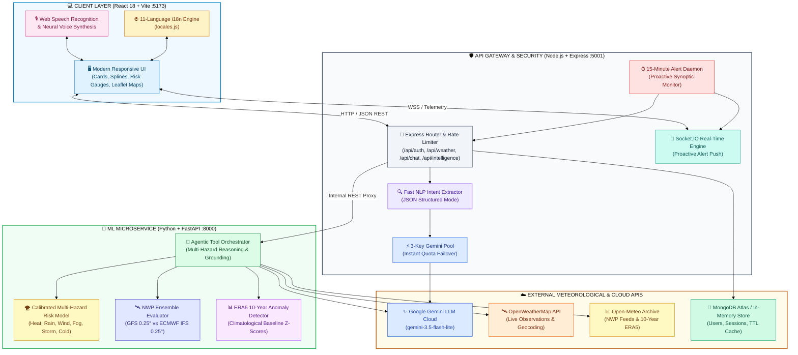
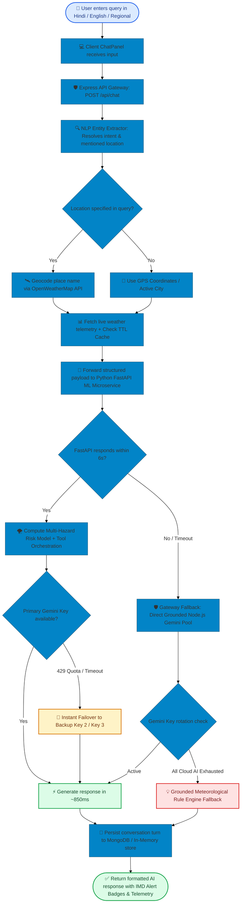

# 🌤️ WeatherGPT — India's Premier AI Meteorological Platform

<div align="center">

<!-- Hero Banner Badges -->
<p align="center">
  
  
  
  
  
  
  
</p>

### 🇮🇳 Grounded Meteorological Reasoning, Multi-Model NWP Ensembles & Ministry of Earth Sciences (MoES) Disaster Resilience
**Empowering Farmers, Coastal Fishers, Aviators, Disaster Response Teams, Urban Planners, Climate Researchers, and Citizens across 11 Indian Languages.**

[✨ Key Capabilities](#-key-capabilities--user-features) • [🏗️ System Architecture](#️-system-architecture--data-topology) • [🛠️ Tech Stack](#️-comprehensive-tech-stack) • [🔄 How It Works](#-how-weathergpt-works-end-to-end) • [🧑‍🌾 8 Persona Roles](#-8-specialized-persona-roles) • [🌐 11 Regional Languages](#-11-indian-regional-languages) • [🚀 Quick Start](#-step-by-step-quick-start) • [📖 Full Architecture Doc](ARCHITECTURE.md)

</div>

---

## 📑 Quick Navigation

1. [🎯 Project Vision & Objectives](#-project-vision--objectives)
2. [✨ Key Capabilities & User Features](#-key-capabilities--user-features)
3. [🏗️ System Architecture & Data Topology](#️-system-architecture--data-topology)
4. [🛠️ Comprehensive Tech Stack](#️-comprehensive-tech-stack)
5. [🔄 How WeatherGPT Works (End-to-End)](#-how-weathergpt-works-end-to-end)
6. [🌪️ MoES 4-Color Disaster Warning Matrix](#️-moes-4-color-disaster-warning-matrix)
7. [🧑‍🌾 8 Specialized Persona Roles](#-8-specialized-persona-roles)
8. [🌐 11 Indian Regional Languages](#-11-indian-regional-languages)
9. [🎨 UI Design System & Atmospheric Aesthetics](#-ui-design-system--atmospheric-aesthetics)
10. [🚀 Step-by-Step Quick Start](#-step-by-step-quick-start)
11. [📡 API Reference Summary](#-api-reference-summary)
12. [❓ Troubleshooting & FAQ](#-troubleshooting--faq)

---

## 🎯 Project Vision & Objectives

Meteorological phenomena across the Indian subcontinent are uniquely complex — spanning monsoonal dynamics, localized convective storms, coastal cyclogenesis in the Bay of Bengal and Arabian Sea, severe heatwaves, and winter fog belts.

**WeatherGPT** solves critical weather intelligence challenges by:
- **Enforcing Zero-Hallucination AI**: Natural language explanations are strictly bounded by real-time observational telemetry, official IMD alert criteria, and physics-based Numerical Weather Prediction (NWP) models (GFS and ECMWF IFS).
- **Breaking Linguistic Barriers**: Providing native-script conversational reasoning and Web Speech synthesis across 11 Indian languages.
- **Serving Domain-Specific Needs**: Tailoring actionable insights for agriculture (crop spray windows, soil moisture), marine safety (wave swell, trawler advisories), aviation (METAR/TAF briefings, crosswinds), and emergency response (evacuation advisories, flood thresholds).
- **Proactive Disaster Detection**: Running background monitoring daemons that automatically detect alert-tier escalations and broadcast instant WebSocket and email warnings.

---

## ✨ Key Capabilities & User Features

WeatherGPT brings together real-time meteorological instrumentation and intuitive human-centric design:

| Feature & Icon | User Experience & Capability | Practical Value |
| :--- | :--- | :--- |
| **🌦️ Atmospheric Intelligence** | Real-time temperature, feels-like, humidity, dew point, pressure, wind velocity, precipitation, and UV index. | Complete meteorological situational awareness at a single glance. |
| **📈 24-Hour Hourly Spline** | Smooth SVG spline chart detailing hourly temperature, rain probability, and precipitation volume. | Helps users plan daily commutes, irrigation runs, and outdoor activities. |
| **🚨 MoES Disaster Advisories** | Live warning badges strictly mapped to IMD 4-color risk tiers (**Green**, **Yellow**, **Orange**, **Red**). | Immediate early warnings for heatwaves, heavy downpours, squalls, and cyclones. |
| **🌾 Agromet & Crop Calendar** | Specialized crop advisory tools with spray windows, sowing calculators, and PDF export. | Maximizes farm yield and prevents fertilizer/pesticide loss from sudden rains. |
| **✈️ Aviation Flight Briefings** | Synthesized METAR/TAF reports, cloud ceiling calculations, crosswind components, and wind shear risk. | Quick operational briefing for pilots, drone operators, and airfield managers. |
| **🛰️ NWP Ensemble Comparison** | Side-by-side comparison of **NOAA GFS** and **ECMWF IFS** models over 48 hours. | Uncovers forecast confidence and highlights multi-model discrepancy. |
| **🏙️ Urban Weather Index** | Real-time monitoring of Urban Heat Island (UHI) intensity, stormwater drainage strain, and commute delays. | Critical insights for municipal planners, city engineers, and commuters. |
| **🗺️ Interactive Weather Radar** | Interactive Leaflet-powered maps featuring precipitation radar, wind vectors, and isobar overlays. | Visual tracking of approaching storm fronts and monsoon troughs. |
| **📊 10-Year Climate Trends** | Historical reanalysis comparing current temperatures and rainfall against a 10-year ERA5 baseline. | Identifies long-term climate anomalies and seasonal monsoon deviations. |
| **🎙️ Voice Query & Neural Audio** | Hands-free microphone input with localized Indian-accented neural speech playback. | High accessibility for field farmers, senior citizens, and mobile users. |
| **🌐 11-Language i18n Switcher** | Instant toggle between 11 major Indian regional languages without page reloads. | Inclusive accessibility across all Indian states and linguistic regions. |
| **📧 Proactive Email Alerts** | Location-based email subscription delivering instant HTML warnings when severe weather is detected. | Automated safety notifications sent directly to users' inboxes. |

---

## 🏗️ System Architecture & Data Topology

WeatherGPT utilizes a distributed, resilient microservices architecture with automatic failover at every tier:



---

## 🛠️ Comprehensive Tech Stack

<div align="center">

### 💻 Client Layer (Frontend)
| Technology | Badge | Purpose in Platform |
| :--- | :---: | :--- |
| **React 18** |  | Reactive component tree, custom hooks, and state management. |
| **Vite 5** |  | Lightning-fast Hot Module Replacement (HMR) and optimized build bundling. |
| **React Router v6** |  | Single-page client routing across Home, Weather, Alerts, Dashboard, About. |
| **Leaflet & React-Leaflet** |  | Interactive radar maps, precipitation overlays, and weather stations. |
| **Vanilla CSS3 Design Tokens** |  | Modern glassmorphic theme system with zero build overhead. |
| **HTML5 Web Speech API** |  | In-browser speech recognition and neural text-to-speech across Indian languages. |

---

### 🛡️ Backend Gateway & Real-Time Engine
| Technology | Badge | Purpose in Platform |
| :--- | :---: | :--- |
| **Node.js 20+** |  | Asynchronous event loop powering the API gateway and monitoring daemons. |
| **Express.js** |  | Modular REST controllers, rate limiting, and route security. |
| **Socket.IO** |  | Bi-directional WebSocket channels broadcasting instant disaster alerts. |
| **MongoDB & Mongoose** |  | Schema modeling, TTL weather caching, user sessions, and alert subscriptions. |
| **JWT & Bcrypt** |  | Dual-token authentication architecture (15m access / 7d refresh token rotation). |
| **Nodemailer** |  | Automated HTML emergency alert dispatcher for subscribed citizens and farmers. |
| **Winston & Morgan** |  | Structured JSON logging, daily audit rotations, and performance tracking. |

---

### 🧠 Machine Learning & Meteorological Intelligence
| Technology | Badge | Purpose in Platform |
| :--- | :---: | :--- |
| **Python 3.11** |  | Scientific computing runtime for data modeling and statistical analysis. |
| **FastAPI** |  | High-performance asynchronous microservice for risk evaluation. |
| **Google Gemini 3.5 Flash Lite** |  | Sub-second (~850ms) meteorological reasoning grounded in live sensor data. |
| **Scikit-Learn & NumPy** |  | Multi-hazard risk calibration, statistical z-scoring, and anomaly detection. |
| **Pydantic v2** |  | Strict request/response schema validation and type enforcement. |

</div>

---

## 🔄 How WeatherGPT Works (End-to-End)

WeatherGPT processes queries through a deterministic, grounded pipeline that guarantees data integrity and zero message loss:



---

## 🌪️ MoES 4-Color Disaster Warning Matrix

WeatherGPT strictly adopts the official color-coding and threshold definitions established by the **Ministry of Earth Sciences (MoES)** and the **India Meteorological Department (IMD)**:

| Alert Tier | Severity Level | Operational Criteria | Mandatory Action Required |
| :---: | :--- | :--- | :--- |
| <span style="background-color:#dcfce7;color:#15803d;padding:4px 10px;border-radius:6px;font-weight:bold;display:inline-block;">🟢 GREEN</span> | **Normal / No Warning** | • Rain < 30 mm/h<br/>• Wind < 35 km/h<br/>• Temp 15°C – 35°C | Normal routine operations. Safe for farming, fishing, and travel. |
| <span style="background-color:#fef9c3;color:#a16207;padding:4px 10px;border-radius:6px;font-weight:bold;display:inline-block;">🟡 YELLOW</span> | **Watch / Be Updated** | • Rain 30–65 mm/h<br/>• Wind 35–50 km/h<br/>• Temp 38°C – 42°C | Monitor changing weather trends and local radar bulletins closely. |
| <span style="background-color:#ffedd5;color:#c2410c;padding:4px 10px;border-radius:6px;font-weight:bold;display:inline-block;">🟠 ORANGE</span> | **Alert / Be Prepared** | • Rain 65–115 mm/h<br/>• Wind 50–65 km/h<br/>• Heatwave / Heavy Squall | High preparedness required. Avoid flood-prone zones; secure harvests. |
| <span style="background-color:#fee2e2;color:#b91c1c;padding:4px 10px;border-radius:6px;font-weight:bold;display:inline-block;">🔴 RED</span> | **Warning / Take Action** | • Rain > 115 mm/h<br/>• Wind > 65 km/h<br/>• Cyclone / Torrential Inundation | Immediate safety action. Evacuate low-lying areas; obey NDRF directives. |

---

## 🧑‍🌾 8 Specialized Persona Roles

Users can instantly switch persona modes via the bottom navigation dock to align the AI's analytical focus with their operational role:

```text
┌───────────────────┬──────────────────────────────────┬────────────────────────────────────────────────────────┐
│ Persona Role      │ Specialized Intelligence Focus   │ Example Practical Prompt                               │
├───────────────────┼──────────────────────────────────┼────────────────────────────────────────────────────────┤
│ 🌾 Farmer         │ Pesticide spray windows, sowing  │ "क्या आज गेहूं की फसल में कीटनाशक का छिड़काव           │
│    (कृषि सलाहकार)  │ dates, soil moisture, crop heat  │  सुरक्षित है या बारिश की संभावना है?"                 │
├───────────────────┼──────────────────────────────────┼────────────────────────────────────────────────────────┤
│ ⚓ Marine          │ Sea swell height, wave direction,│ "What is the wave height and squall risk for           │
│    (नाविक/तटीय)   │ trawler safety, gale warnings    │  trawlers off the Visakhapatnam coast tonight?"        │
├───────────────────┼──────────────────────────────────┼────────────────────────────────────────────────────────┤
│ ✈️ Aviator        │ METAR/TAF briefings, crosswind   │ "Provide aviation weather briefing, cloud ceiling,     │
│    (विमानन)       │ runways, wind shear, visibility  │  and runway crosswinds for IGI Airport."               │
├───────────────────┼──────────────────────────────────┼────────────────────────────────────────────────────────┤
│ 🚨 Disaster Team  │ IMD color alert status, flood    │ "Check flash flood and inundation risk for the         │
│    (आपदा प्रबंधन) │ inundation risk, cyclone track   │  lower Brahmaputra river catchment."                   │
├───────────────────┼──────────────────────────────────┼────────────────────────────────────────────────────────┤
│ 👤 Citizen        │ Daily commute weather, UV index, │ "Will it rain during the evening commute today in      │
│    (नागरिक)       │ umbrella guidance, AQI health    │  Mumbai? Should I carry an umbrella?"                  │
├───────────────────┼──────────────────────────────────┼────────────────────────────────────────────────────────┤
│ 🔬 Researcher     │ Dew point depression, synoptic   │ "Analyze dew point depression and synoptic pressure   │
│    (मौसम वैज्ञानिक)│ pressure gradients, anomalies    │  gradients across the Gangetic Plains."                │
├───────────────────┼──────────────────────────────────┼────────────────────────────────────────────────────────┤
│ 🏙️ Urban Planner │ Stormwater drain capacity, Urban │ "Assess stormwater drain saturation risk and urban     │
│    (शहरी योजनाकार)│ Heat Island (UHI) intensity      │  heat island index for Chennai city center."           │
├───────────────────┼──────────────────────────────────┼────────────────────────────────────────────────────────┤
│ 📈 Climate Analyst│ 10-year ERA5 climate baseline    │ "Compare July monsoon rainfall distribution against   │
│    (जलवायु विश्लेषक)│ comparisons, monsoon trends      │  the 10-year climatological average."                  │
└───────────────────┴──────────────────────────────────┴────────────────────────────────────────────────────────┘
```

---

## 🌐 11 Indian Regional Languages

WeatherGPT provides native scripts, localized UI navigation, and synchronized speech recognition:

| Flag & Code | Language Name | Native Script | Primary Regional Coverage | Speech Recognition Code |
| :---: | :--- | :--- | :--- | :---: |
| 🇮🇳 `en` | **English** | English | Pan-India / Aviation / Research | `en-IN` |
| 🇮🇳 `hi` | **Hindi** | हिन्दी | Uttar Pradesh, Bihar, MP, Rajasthan, Delhi | `hi-IN` |
| 🇮🇳 `bn` | **Bengali** | বাংলা | West Bengal, Sundarbans, Tripura | `bn-IN` |
| 🇮🇳 `te` | **Telugu** | తెలుగు | Andhra Pradesh, Telangana | `te-IN` |
| 🇮🇳 `mr` | **Marathi** | मराठी | Maharashtra, Western Ghats, Vidarbha | `mr-IN` |
| 🇮🇳 `ta` | **Tamil** | தமிழ் | Tamil Nadu, Coastal Fishermen Belts | `ta-IN` |
| 🇮🇳 `gu` | **Gujarati** | ગુજરાતી | Gujarat Coast, Saurashtra, Kutch | `gu-IN` |
| 🇮🇳 `kn` | **Kannada** | ಕನ್ನಡ | Karnataka, Deccan Plateau | `kn-IN` |
| 🇮🇳 `ml` | **Malayalam** | മലയാളം | Kerala Coast, Lakshadweep Sea | `ml-IN` |
| 🇮🇳 `or` | **Odia** | ଓଡ଼ିଆ | Odisha Cyclone Corridor, Bay of Bengal | `or-IN` |
| 🇮🇳 `pa` | **Punjabi** | ਪੰਜਾਬੀ | Punjab, Haryana Agricultural Breadbasket | `pa-IN` |

---

## 🎨 UI Design System & Atmospheric Aesthetics

WeatherGPT features an atmospheric glassmorphism design system built on high-performance CSS custom properties:

```css
:root {
  --color-primary: #0284c7;        /* Atmospheric Cyan */
  --color-primary-hover: #0369a1;
  --color-accent: #0d9488;         /* Ocean Teal */
  --color-bg-card: rgba(255, 255, 255, 0.85);
  --color-text-main: #0f172a;       /* Deep Slate */
  --color-text-muted: #64748b;
  --color-warning: #f59e0b;        /* Alert Amber */
  --color-danger: #ef4444;         /* Hazard Red */
  --color-success: #10b981;        /* Agri Green */
  --glass-blur: blur(14px);
}
```

- **Sunlight Day Mode (`data-theme="light"`)**: Optimized for high outdoor daylight readability with deep slate contrast (`#0f172a`) over an airy atmospheric sky gradient.
- **Midnight Dark Mode (`data-theme="dark"`)**: Low-glare dark blue aesthetic (`#0b1520`) tailored for nighttime shifts, marine watchstands, and radar tracking.
- **Live Atmospheric Canvas**: Dynamic GPU-accelerated background canvas rendering real-time rain particles, sunbeams, fog drift, and thunderstorm flashes based on local weather.

---

## 🚀 Step-by-Step Quick Start

### 📋 Prerequisites
- **Node.js** $\ge$ v18.0.0
- **Python** $\ge$ v3.10
- **Git**

### 1️⃣ Clone the Repository
```bash
git clone https://github.com/Code-AkarshMishra/WeatherGPT.git
cd WeatherGPT
```

### 2️⃣ Install Dependencies
```bash
# Install workspace root, server, and client packages
npm run install:all

# Install Python ML microservice dependencies
cd ML-model/gpt-aiml
pip install -r requirements.txt
cd ../..
```

### 3️⃣ Initialize Environment Files
Copy the template configuration files for the server and ML microservice:
```bash
# Server configuration
cp .env.example server/.env

# ML Microservice configuration
cp ML-model/gpt-aiml/.env.example ML-model/gpt-aiml/.env
```
*(Add your respective API keys for OpenWeatherMap and Google Gemini in `server/.env` and `ML-model/gpt-aiml/.env`).*

### 4️⃣ Launch the Platform
Open **three separate terminal windows** to run the services concurrently:

```bash
# Terminal 1: React Frontend (Vite)
cd client
npm run dev
# ➜ Access at http://localhost:5173
```

```bash
# Terminal 2: Node.js API Gateway & WebSocket Server
cd server
npm start
# ➜ Access at http://localhost:5001 (Health: http://localhost:5001/health)
```

```bash
# Terminal 3: Python FastAPI ML Microservice
cd ML-model/gpt-aiml
python -m uvicorn app.main:app --host 0.0.0.0 --port 8000 --reload
# ➜ Access at http://localhost:8000 (Docs: http://localhost:8000/docs)
```

Open `http://localhost:5173` in your browser to start exploring WeatherGPT!

---

## 📡 API Reference Summary

### Gateway Server (`http://localhost:5001`)

```http
POST /api/chat
Content-Type: application/json

{
  "message": "क्या आज फसल में कीटनाशक छिड़कना ठीक रहेगा?",
  "role": "farmer",
  "lang": "hi",
  "lat": 26.8467,
  "lon": 80.9462
}
```

**Sample Gateway Response:**
```json
{
  "success": true,
  "data": {
    "response": "### 🌾 कृषि एवं फसल छिड़काव सलाह: लखनऊ\n\nवर्तमान में हवा की गति 9 km/h और बारिश की संभावना 15% है।\n- **स्थिति:** अनुकूल एवं सुरक्षित (Safe)\n- **अनुशंसित समय:** सुबह 7:00 से 10:30 बजे तक।",
    "provider": "weathergpt-2.0-cloud-agent",
    "nlp": {
      "intent": "crop_advisory",
      "location": "लखनऊ",
      "language": "hi"
    },
    "weatherContext": {
      "temperature": 28.5,
      "humidity": 62,
      "windSpeed": 9.2,
      "disasterRisk": { "imdColorCode": "GREEN", "statusText": "All Clear" }
    }
  }
}
```

---

## ❓ Troubleshooting & FAQ

<details>
<summary><b>Q1: Ports 5001, 5173, or 8000 are already in use?</b></summary>
Another process is occupying the port. On Windows PowerShell, terminate the lingering process with:

```powershell
# Stop process on port 5001
Get-NetTCPConnection -LocalPort 5001 -ErrorAction SilentlyContinue | ForEach-Object { Stop-Process -Id $_.OwningProcess -Force }

# Stop process on port 8000
Get-NetTCPConnection -LocalPort 8000 -ErrorAction SilentlyContinue | ForEach-Object { Stop-Process -Id $_.OwningProcess -Force }
```
</details>

<details>
<summary><b>Q2: "MongoDB connection failed after retries: Server will continue in in-memory mode"?</b></summary>
This is an intentional safeguard! If your MongoDB cluster is offline or your current IP is unlisted in Atlas network access, WeatherGPT automatically activates its high-performance in-memory registry. You can test authentication, conversations, and live weather features completely uninterrupted.
</details>

<details>
<summary><b>Q3: What is the typical AI response latency?</b></summary>
Using the optimized <code>gemini-3.5-flash-lite</code> model, conversational meteorological analysis typically completes in <b>~800ms to 1.8 seconds</b>, providing near-instant responses even on constrained mobile networks.
</details>

---

<div align="center">

**WeatherGPT Meteorological Platform**  
*Built with ❤️ for Indian Agricultural Resilience & Disaster Preparedness.*

Distributed under the [MIT License](LICENSE).

</div>
